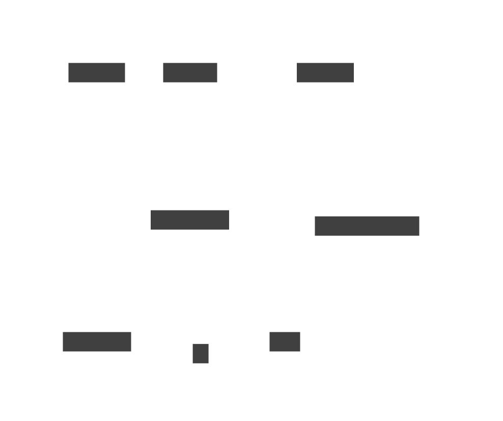

# Arquitetura

O sistema está distribuído nos seguites componentes:

- Aplicativo (Android e IOS)
- Backend (Java com spring boot)
- Banco de dados (Mysql)
- Filas (RabbitMQ ou Apache Kafka)
- Firebase
- Middleware (PHP com symfony)
- Pulseira (Sistema embarcado)

O **Aplicativo** é responsável pela interaçao com usuário, onde o mesmo irá cadastrar informações pessoais, contatos
de emergência, etc.

O **Backend** é responsável por gerir todos os dados do usuário. Além disso ele irá emitir messagens de aviso para os
contatos de emergência.

O **Middleware** terá como função fazer o *"meio de campo"*, entre todos os componentes com exceção do **Banco de dados**.
Ele será um nó gestor do nosso sistema distribuído.

Já o **Firebase** terá como função fazer a gestão de sessão de usuário.
