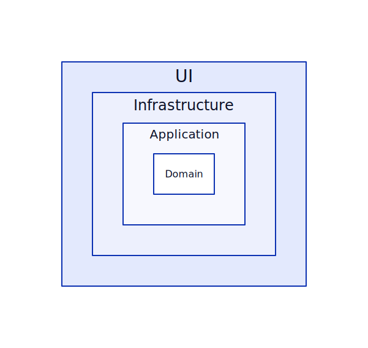

# Middleware

A arquitetura do codigo do **Middleware** é inspirada na **hexagonal architectrure**. contendo a seguintes camada:

- Application
- Domain
- Infrastructure
- UI

A camada de **domain** é definido os objetos que serão manipulados no sistema, por exemplo o objeto de Usuario.

Na camada de **application**, é onde será realizada as manipulações de tudo que é definida na camada **domain**.

A camada de **infrastructure** é reponsável por impletar as interface declaradas pelo **domain**, onde será
utilizadas as ferramentas oferecidas pelo framework ou pacotes externos.

Já a camada de **UI**, irá ser reponsável pela interação com os sistemas externos ou aplicativos, no caso API FULL REST.

